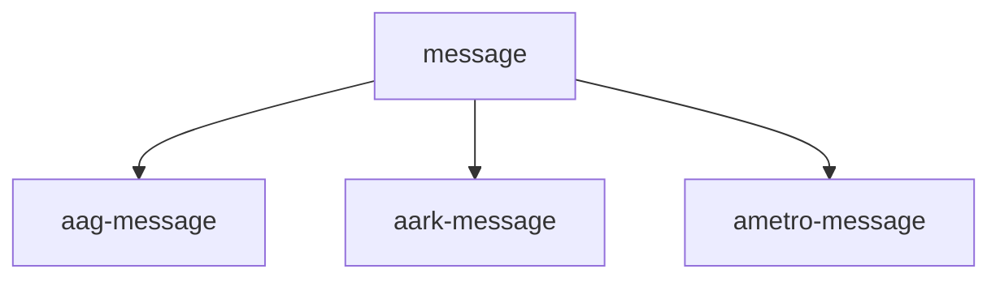

Mass Transit Singe Active Consumer / Routing Demo
===============

The demo includes two console apps:

Consumer
--------
Includes configuration to create the queues and exchanges as well as a consumer
that will log all the messags it recieves.

Running the app with the following parameters:

    dotnet run --clientCodes "aag,aark,ametro"

Will create an exchange named "message" that routes messages to client sepcific
queues based on the ClientCode property of the messaage.

You can run multiple instances of the consumer app to see how the "Singe Active
Consumer" SAC setting works. There are also additional command line options that
may help with learning. Here's another example that shows all the options:

    dotnet run `
      --clientCodes "aag,aark" `
      --delayInSeconds 3 `
      --prefetchCount 16 `
      --concurrentMessageLimit 10

Producer
--------
Includes configuration to send messages to the "message" exchange using
ClientCode as a routing key. It doesn't know there are separate queues for each
client.

It can be run with the following command:

    dotnet run --clientCodes "aag,aark,ametro" --publishPerSecond 1
